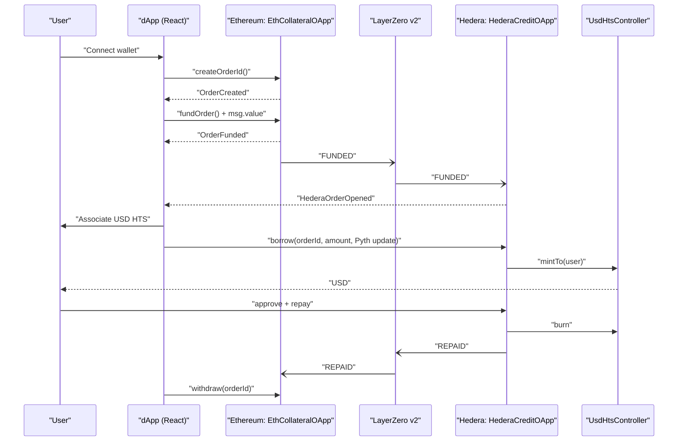

# KINXP — Cross-Chain Collateral → USD on Hedera

Lock crypto (starting with ETH on Ethereum/Sepolia) as collateral and mint USD on **Hedera** (HTS). Messaging is handled by **LayerZero v2**; pricing/limits use **Pyth**. Repay on Hedera to unlock your ETH back on Ethereum.

## Why Hedera

* **Fast & predictable fees:** high throughput, low/consistent costs.
* **HTS tokens with first-class ops:** native mint/burn/associate via precompile (`0x167`) with an ERC-20 facade for wallets.
* **Great for settlement rails:** mint/burn semantics map cleanly to credit lines.

## Architecture

* **Ethereum / L1–L2 side**

  * `EthCollateralOApp.sol` — receives ETH, records per-order collateral, optionally sends a LayerZero **FUNDED** message to Hedera.
* **Hedera side**

  * `UsdHtsController.sol` — owns the USD HTS token supply key; mints to borrowers and burns on repayment.
  * `HederaCreditOApp.sol` — enforces LTV using **Pyth** (ETH/USD), mints USD via the controller, burns on repayment, and can notify Ethereum (LayerZero) when fully repaid.
* **Messaging**

  * **LayerZero v2** (pure messaging; no bridging of value) to mirror funded/repaid state.
* **Price**

  * **Pyth** pull model (Hermes payloads) for ETH/USD.

> Today the reference flow uses ETH on Sepolia → USD (HTS) on Hedera Testnet. Adapting to other EVM chains involves deploying another `*CollateralOApp` and wiring LayerZero peers.



## Blockscout Integration

**Blockscout** serves as our definitive source of truth for transaction statuses, logs, and token states across different chains. This integration allows us to feed verifiable, on-chain facts directly into our risk analysis logic.

### Dedicated Blockscout Instance (Hedera)

To ensure reliable data access, we have deployed a dedicated Blockscout instance specifically for the Hedera Testnet using standard deployment tools.

-   **Frontend Access:** The user interface connects to this instance through a Vite proxy configuration:
    -   ` /blockscout-api → https://hedera.cloud.blockscout.com `
-   **Primary Use Case:** We continuously poll this endpoint to confirm that an order funded on Ethereum has been successfully mirrored and opened on Hedera.

### Blockscout App SDK in the Frontend

Our React application leverages the `@blockscout/app-sdk` to standardize how we access and format blockchain data. By combining the SDK providers with the Logs API, we can:

-   **Detect Events:** Quickly identify key on-chain events, such as `HederaOrderOpened`.
-   **Improve User Experience:** Surface deep-links to addresses and transactions within the UI.
-   **Maintain State:** Keep the application's state aligned with Blockscout's indexing, removing the need for us to operate our own indexer.

### Blockscout MCP for Risk Intelligence

Our backend server utilizes the **Blockscout MCP (Model Context Protocol)** to enhance our risk assessment capabilities. The MCP fetches first-party chain data (transaction details, logs, address activity) and feeds it to a Large Language Model (LLM) to estimate proxies for liquidation risk.

The LLM never "guesses" raw data; MCP provides the verifiable facts, and structured prompting composes these facts into simple risk flags that the UI can display.

Signals we analyze for risk include:

-   Recent liquidation densities in the market.
-   Sharp, sudden bursts in DEX volume or large swaps through common routers.
-   Significant CEX hot-wallet inflows or outflows.
-   Abnormal or suspicious token approval patterns.


## User Flow

1. **Create order (Ethereum)** → deterministic `orderId`.
2. **Fund collateral (Ethereum)** → send ETH to `EthCollateralOApp`.
3. **Mirror on Hedera** (LayerZero message opens the order on Hedera).
4. **Associate USD HTS** (one-time in wallet).
5. **Borrow USD (Hedera)** → submit Pyth update data; contract enforces LTV and mints USD.
6. **Repay USD (Hedera)** → burns USD; optionally notifies Ethereum.
7. **Withdraw ETH (Ethereum)** → after **REPAID** is acknowledged, withdraw collateral.

## Repos / Packages

* `packages/contracts` — Hardhat workspace

  * `contracts/eth/EthCollateralOApp.sol`
  * `contracts/hedera/UsdHtsController.sol`
  * `contracts/hedera/HederaCreditOApp.sol`
* `packages/server` — Express API (escrow hooks, price, simple health math)
* `packages/web` — React app: Create → Fund → Borrow → Repay → Withdraw

## Quickstart

```bash
# 1) Install
pnpm i

# 2) Env (per package as needed)
# cp packages/contracts/.env.example packages/contracts/.env
# cp packages/server/.env.example packages/server/.env
# cp packages/web/.env.example packages/web/.env

# 3) Dev servers
pnpm --filter @kinxp/server dev &
pnpm --filter @kinxp/web dev

# (optional) Contracts build
pnpm --filter @kinxp/contracts build
```
## Status & scope

Testnets: Sepolia ↔ Hedera Testnet.

Assets: ETH → USD (HTS) first; more chains/assets are straightforward via another Collateral OApp.

## Security

Prototype code; not audited. Use only on testnets.
